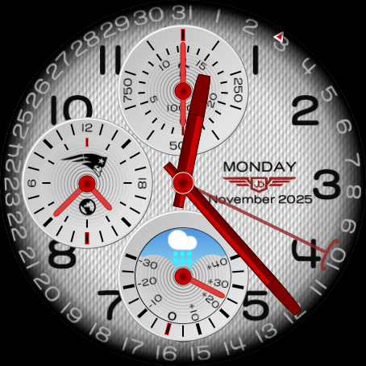
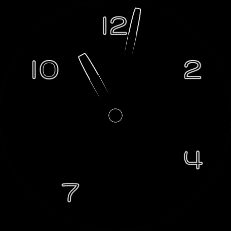

# Junghaus Longie Watch Face

A premium chronograph-style watch face for Wear OS devices, designed using the Watch Face Format (WFF) with vector graphics for optimal clarity and scalability. Optimized for Galaxy Watch 8 Classic and compatible with other Wear OS devices.

## Features

- **Chronograph Design**: Three subdials displaying:
  - 24-hour time indicator - Currently set to USA
  - Steps counter
  - Weather with temperature
- **Date Display**: Full weekday and date with month and year
- **Dual Display Modes**:
  - Active mode with full color and complications
  - Ambient mode with simplified black and white design
- **Customizable Color Themes**: Two built-in color schemes
  - San Francisco Time (default)
  - New York Time
- **Vector-Based Graphics**: Crisp display at any resolution
- **Weather Integration**: Support for weather icon display (day/night variants)
- **Low Battery insicator**: The logo turns to red when battery is below 30%

## Screenshots

### Active Mode


The active mode features a detailed chronograph layout with:
- Red hour, minute, and second hands
- Three functional subdials
- Moon phase complication
- Full date and day display
- Textured dial background
- battery is below 30% (red logo)

### Ambient Mode


The ambient mode provides a battery-efficient minimal design with:
- High contrast white on black
- Essential hour markers (12, 2, 4, 7, 10)
- Basic hour and minute hands
- Clean, power-saving display

## Technical Details

- **Platform**: Wear OS (Watch Face Format v2)
- **Graphics**: Vector-based XML design
- **Dimensions**: 450x450 pixels
- **Preview Time**: 10:08:30
- **Weather Icons**: Dual bitmap font sets for day/night conditions
- **Standalone**: No companion app required

## Project Structure

```
wff/
├── src/main/
│   ├── AndroidManifest.xml
│   └── res/
│       ├── raw/
│       │   └── watchface.xml     # Main watch face definition
│       ├── xml/
│       │   └── watch_face_info.xml
│       └── values/
│           └── strings.xml
├── resources/
│   ├── day_preview.png           # Active mode preview
│   └── ambient_preview.png       # Ambient mode preview
└── README.md
```

## Building & Installation

1. Open the project in Android Studio
2. Connect your Wear OS device or start an emulator
3. Build and run the project
4. The watch face will be installed and available in your watch face picker

## Color Themes

The watch face includes two pre-configured color themes:

1. **San Francisco Time** (Theme 0): Default red accent colors
2. **New York Time** (Theme 1): Alternative color palette

Themes can be selected through the watch face customization settings on your device.

## Complications Support

The watch face is designed to support various complications including:
- Steps counter
- Moon phase indicator
- 24-hour time display
- Weather conditions (with day/night icon variants)

## License

This is a custom watch face design. All rights reserved.
